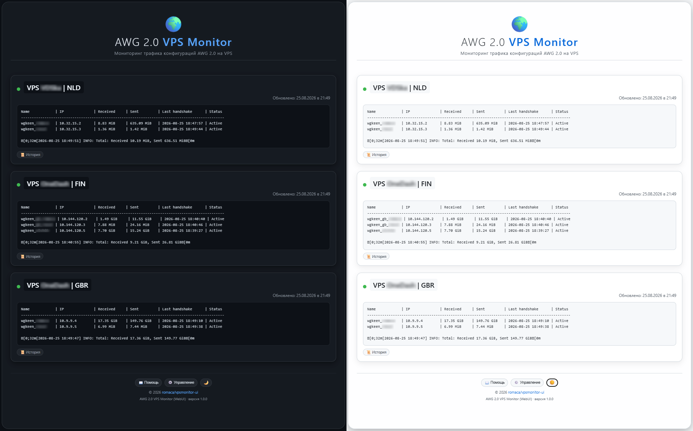
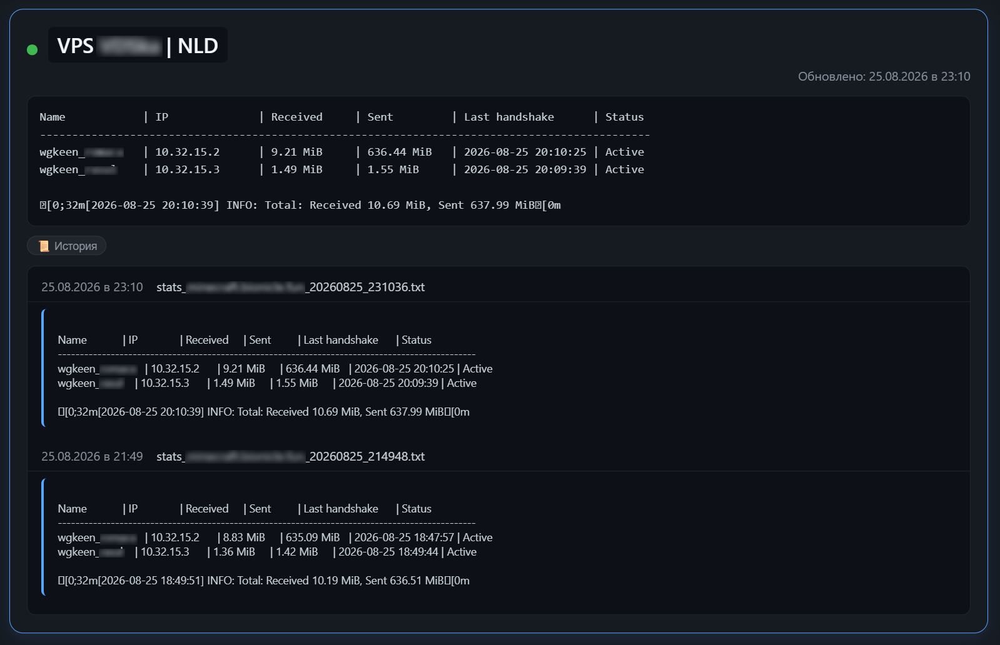

# AWG 2.0 VPS Monitor – WebUI 
### Мониторинг трафика конфигураций AWG 2.0 на VPS
---
**AWG 2.0 VPS Monitor – WebUI** — это легковесное веб-решение для централизованного сбора и визуализации статистики трафика клиентов WireGuard (AmneziaWG 2.0) с нескольких удалённых VPS-серверов. Система разработана для работы на роутерах Keenetic/Netcraze под управлением Entware и не требует установки дополнительного ПО на VPS (используется штатный скрипт `manage_amneziawg.sh`).

Проект решает задачу оперативного мониторинга использования трафика в условиях, когда прямое подключение к VPS ограничено, а доступ к панелям управления отсутствует. Он агрегирует данные со всех серверов в едином интерфейсе, сохраняет историю изменений и позволяет быстро анализировать нагрузку по каждому клиенту. Благодаря использованию SSH и `expect`, система не требует внесения изменений в конфигурацию серверов и работает с существующей инфраструктурой.

**Разработано и протестировано для [AmneziaWG 2.0](https://github.com/bivlked/amneziawg-installer) (`install_amneziawg_en.sh`) на Ubuntu 24. Совместимость с другими реализациями не гарантируется.**

---





---

## Содержание
- [Возможности](#возможности)
- [Требования](#требования)
- [Установка](#установка)
- [Совместимость](#совместимость)
- [Безопасность](#безопасность)
- [Управление](#управление)
- [Удаление](#удаление)

---

## Возможности

- **Автоматический сбор статистики** — гибкая настройка частоты опроса (от 1 до 4 раз в сутки или 1–3 раза в неделю) через cron.
- **Адаптивный интерфейс** — поддержка тёмной и светлой темы, корректное отображение на ПК и смартфонах.
- **История изменений** — все собранные данные сохраняются в виде текстовых файлов с временными метками, доступен просмотр любого сохранённого состояния.
- **Переименование серверов** — клик по IP-адресу или домену в WebUI позволяет задать удобное имя, которое сохраняется локально на роутере.
- **Обрезка вывода** — автоматическое удаление первых 8 строк (заголовок) и последней строки (избыточный разделитель) из вывода скрипта статистики, что оптимизирует отображение.
- **Безопасность** — все данные (адреса, пароли) хранятся исключительно локально на роутере, никакие данные не передаются разработчику или третьим лицам.

## Требования

- **Роутер Keenetic / Netcraze** с установленным **Entware**.
- **VPS-серверы с [AmneziaWG 2.0](https://github.com/bivlked/amneziawg-installer)**, установленным через скрипт `install_amneziawg_en.sh` (команда `/root/awg/manage_amneziawg.sh stats` должна быть доступна).
- **Установленные пакеты** на роутере: `python3`, `expect`, `cron`, `dos2unix` (установщик добавит их автоматически при необходимости).
- **Потребление памяти** — около 15 МБ для Python.

## Установка

Подключитесь к роутеру по SSH и выполните:

```bash
curl -L -o install.sh https://raw.githubusercontent.com/romaca4/vpsmonitor-ui/main/install.sh
chmod +x install.sh
./install.sh
```

## Совместимость

**Проект разработан для [AmneziaWG 2.0](https://github.com/bivlked/amneziawg-installer) (установщик `install_amneziawg_en.sh`). С другими реализациями WireGuard (стандартный WG, Pi‑VPN и т.д.) работа не гарантируется.** Если вы используете другой скрипт управления, измените команду в `vpsmonitor.sh` внутри функции collect.

## Безопасность

- Пароли SSH хранятся в открытом виде в `/opt/etc/vpsmonitor-ui/vpsmonitor.sh`. Рекомендуется ограничить доступ к этому файлу:

```bash
chmod 600 /opt/etc/vpsmonitor-ui/vpsmonitor.sh
```

- **Все данные остаются локально на роутере и не передаются внешним серверам.** Исходный код открыт и доступен для проверки.

## Управление

| Действие | Команда |
|:---------:|:--------:|
| Остановка веб-сервера | `/opt/etc/init.d/S99vpsmonitor stop` |
Запуск веб-сервера | `/opt/etc/init.d/S99vpsmonitor start` |
Перезапуск веб-сервера | `/opt/etc/init.d/S99vpsmonitor restart` |
Статус веб-сервера | `/opt/etc/init.d/S99vpsmonitor status` |
Ручной запуск сбора статистики | `/opt/etc/vpsmonitor-ui/vpsmonitor.sh` |

### Изменение конфигурации серверов
Для добавления, удаления или изменения параметров VPS отредактируйте файл:
`/opt/etc/vpsmonitor-ui/vpsmonitor.sh`
В нём вы найдёте строки вида `SERVER1="..."`, `PASS1="..."`. После редактирования перезапустите веб-сервер:
```bash
/opt/etc/init.d/S99vpsmonitor stop
/opt/etc/init.d/S99vpsmonitor start
```
### Помощь и справочная информация
Веб-интерфейс содержит встроенную справку (кнопка 📖 Помощь внизу страницы), где описаны:

- Переименование серверов.
- Автоматический сбор статистики.
- Работа с историей.
- Конфиденциальность данных.

Также доступна кнопка ⚙️ **Управление**, в которой собраны команды для редактирования конфигурации и перезапуска сервера.

### Переименование серверов в интерфейсе
На главной странице WebUI кликните по названию сервера (IP или домен), введите новое имя и нажмите Enter. Имена сохраняются в файле `/opt/etc/vpsmonitor-ui/server_names.json`.

## Удаление
### Автоматическое удаление
```bash
curl -L -o uninstall.sh https://raw.githubusercontent.com/romaca4/vpsmonitor-ui/main/uninstall.sh
chmod +x uninstall.sh
./uninstall.sh
```

### Ручное удаление
```bash
/opt/etc/init.d/S99vpsmonitor stop`
rm -f /opt/etc/init.d/S99vpsmonitor
rm -f /opt/etc/rc.d/S99vpsmonitor
rm -rf /opt/etc/vpsmonitor-ui
rm -rf /tmp/vpsmonitor_stats
sed -i '/S99vpsmonitor/d' /opt/etc/init.d/rc.local
(crontab -l 2>/dev/null | grep -v vpsmonitor.sh | crontab -) 2>/dev/null || true
```
(Опционально) Если вы уверены, что пакеты не нужны, удалите их:

```bash
opkg remove python3 expect cron dos2unix
```
